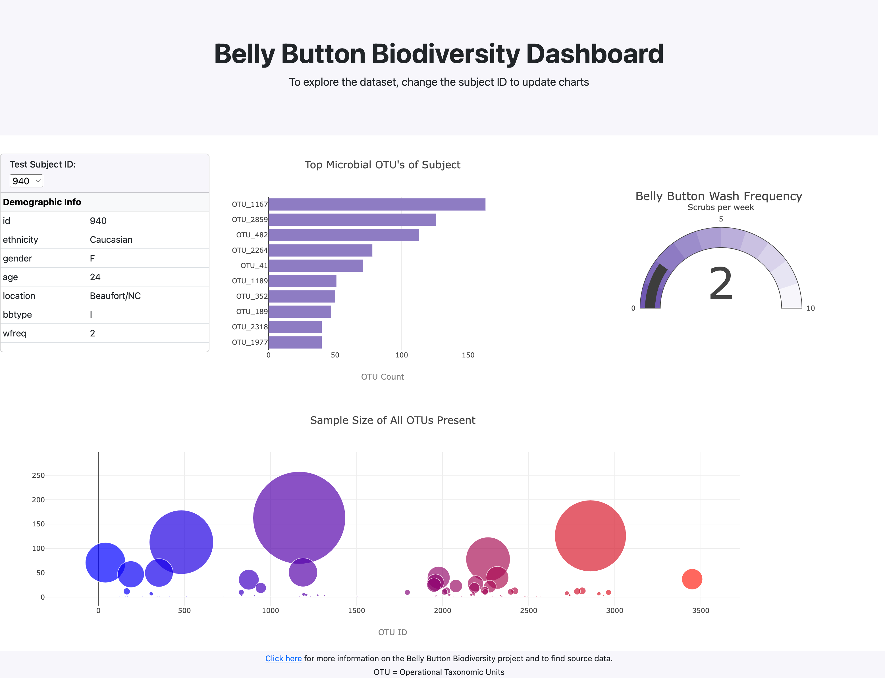

# Belly Button Biodiversity Dashboard
Homework 14 for UMN Data Analysis Boot Camp

## Overview
This webpage uses the [Belly Button Biodiversity](http://robdunnlab.com/projects/belly-button-biodiversity/) dataset to offer interactive visualizations of the micobiome in each test subject's navel. I utilized Plotly, D3, and Bootstrap to graph, handle events, and style the page respectively. The site is hosted on GitHub Pages - [click here](https://anyren.github.io/web-visualization-challenge/) to view the dashboard!

